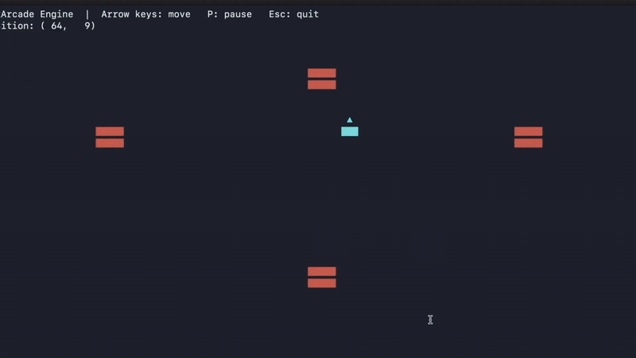

# InkArcade — dotnet Terminal Game Engine

A lightweight **terminal game engine** written in C# / .NET 10. Handles sprites, collision, input, and a diff-based renderer — so you can focus on writing game logic instead of console plumbing.

No external dependencies. Runs on macOS, Linux, and Windows.

---
 

## Quick Start

```bash
git clone https://github.com/blackarck/inkarcade.git
cd inkarcade/TerminalBlaster
dotnet run
```

The included demo renders a moveable sprite and a set of obstacles with live collision detection.

**Requirements:**
- [.NET 10 SDK](https://dotnet.microsoft.com/download)
- Terminal at least **100 columns × 30 rows** (120×35 recommended)
- A monospace font — Menlo, JetBrains Mono, or Consolas

---

## Architecture

```
InkArcade/
├── Engine.cs   → TerminalEngine + Sprite  (the engine — no game knowledge)
├── Program.cs  → demo game using the engine API
```

The engine owns the render loop and the sprite dictionary. Your game owns everything else.

---

## Engine Reference

### Initialise

```csharp
var engine = new TerminalEngine();                      // reads Console.WindowWidth/Height, 60 fps
var engine = new TerminalEngine(120, 35);               // explicit size
var engine = new TerminalEngine(120, 35, targetFps: 30); // explicit size + frame rate
var engine = new TerminalEngine(targetFps: 144);        // auto size, custom frame rate
```

`targetFps` sets the engine's default frame rate (stored as `engine.TargetFps`). You can still override it per-run by passing a value to `Run()` — but setting it once on construction is the cleaner pattern.

Throws `InvalidOperationException` if the terminal is smaller than the minimum (100×30).

---

### Sprite lifecycle

```csharp
// art is a string[] — each line must be the same width
Sprite player = engine.CreateSprite(art, x, y, tag: "player");
Sprite enemy  = engine.CreateSprite(art, x, y, tag: "enemy",  color: ConsoleColor.Red);

engine.DestroySprite(sprite);
```

`color` is any `ConsoleColor` value — `null` (the default) leaves the terminal's default foreground color unchanged.

---

### Movement

```csharp
engine.MoveSprite(sprite, dx, dy);   // relative
engine.SetPosition(sprite, x, y);   // absolute
```

---

### Querying

```csharp
// Returns a snapshot — safe to destroy sprites while iterating the result
List<Sprite> enemies = engine.GetSpritesByTag("enemy");
```

---

### Collision

```csharp
// AABB bounding-box test
bool hit = engine.Overlaps(a, b);

// All sprites of a given tag that overlap the given sprite
List<Sprite> hits = engine.GetCollisions(sprite, "enemy");
```

---

### Input

```csharp
// Non-blocking — returns null if no key is waiting
ConsoleKey? key = engine.PollInput();
```

---

### Text overlays

```csharp
// Rendered on top of sprites. Must be called every frame — cleared after each render.
engine.DrawText(x, y, $"Score: {score}");
engine.DrawText(x, y, "GAME OVER", ConsoleColor.Red);
```

---

### Game loop

```csharp
engine.Run(myGame.Update);              // blocks until Stop() is called; uses engine.TargetFps
engine.Run(myGame.Update, targetFps: 30); // one-off override for this run only
engine.Stop();
```

---

### Pause / Resume

```csharp
engine.Pause();        // freeze update + render; loop thread stays alive
engine.Resume();       // unpause
engine.TogglePause();  // flip between paused and running

bool paused = engine.IsPaused;  // read current state (e.g. to show a HUD indicator)
```

When paused the game loop still ticks at `TargetFps` — it just skips calling your `update` callback and skips rendering. This means resuming is instant with no frame debt.

---

## Sprite Properties

| Property | Type | Description |
|----------|------|-------------|
| `Id` | `int` | Unique identifier assigned on creation |
| `Art` | `string[]` | ASCII art lines |
| `X`, `Y` | `int` | Top-left position in terminal cells |
| `Width` | `int` | `Art[0].Length` |
| `Height` | `int` | `Art.Length` |
| `Tag` | `string` | Grouping label for queries and collision |
| `Visible` | `bool` | Skipped by the renderer when `false` |
| `Color` | `ConsoleColor?` | Foreground color; `null` = terminal default |

---

## How the Renderer Works

Each frame:

1. Fills a `(char, ConsoleColor?)[]` cell buffer of `width × height` with blank/uncolored cells
2. Blits each visible sprite's characters and color into the buffer at `y * width + x`
3. Blits text overlays on top (also carrying an optional color)
4. Compares the cell buffer to the previous frame — skips `Console.Write` entirely when nothing changed
5. If dirty, serialises the buffer to a string with ANSI escape codes inserted only at color transitions, then writes it in a single `Console.Write` call

The dirty check and single-write are why there is no flicker at 60 fps.

---

## Minimal Game Example

```csharp
using InkArcade;

var engine = new TerminalEngine();

string[] shipArt = { " ▲ ", "███" };
var ship = engine.CreateSprite(shipArt, engine.Width / 2, engine.Height - 5, "player", ConsoleColor.Cyan);

engine.Run(() =>
{
    var key = engine.PollInput();
    if (key == ConsoleKey.LeftArrow  && ship.X > 0)                        engine.MoveSprite(ship, -1, 0);
    if (key == ConsoleKey.RightArrow && ship.X < engine.Width - ship.Width) engine.MoveSprite(ship,  1, 0);
    if (key == ConsoleKey.Escape) engine.Stop();

    engine.DrawText(0, 0, $"Position: ({ship.X}, {ship.Y})");
});
```

---

## Terminal Size

The engine rejects undersized terminals at startup with a descriptive error:

```
Terminal is 80×24 — minimum required is 100×30.
Resize your terminal window and try again.
```

| Size | Notes |
|------|-------|
| 100×30 | Minimum |
| 120×35 | Recommended |
| 160×45 | Wide — more room for larger scenes |

**macOS:** Terminal → Preferences → Profiles → Window → Columns / Rows.

---

## Contributing

Fork → branch → commit → pull request.

---

## License

MIT — see [LICENSE](LICENSE).
